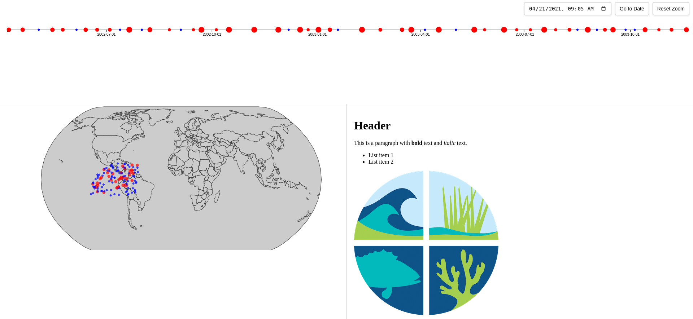

# Timeline Explorer

An interactive visualization tool that brings history to life through an interconnected timeline and map interface. This project allows users to explore historical events across time and space, providing rich context and detailed information for each event.

## Overview

Timeline Explorer combines temporal and geographical data to create an immersive experience for exploring historical events. Whether you're a history enthusiast, educator, or researcher, this tool provides an intuitive way to:

- Navigate through time with an interactive timeline
- Explore events geographically on a world map
- Discover connections between events across time and space
- Access detailed information about historical events through linked documentation

## Features

- **Interactive Timeline**: Zoom and pan through history with an intuitive interface
- **Geographic Mapping**: See where events took place on an interactive world map
- **Event Clustering**: Automatically groups nearby events to prevent overcrowding
- **Detailed Information**: Click any event to view comprehensive documentation
- **Time Navigation**: Jump to specific dates or use the zoom controls to explore different time periods
- **Synchronized Views**: Timeline and map views stay synchronized as you explore

## Use Cases

- **Educational**: Help students visualize historical periods and understand the geographical context of events
- **Research**: Explore patterns and connections between historical events across time and space
- **Storytelling**: Create engaging narratives by showing how events unfold across time and location
- **Data Exploration**: Analyze temporal and geographical patterns in historical data

## Contributing

We welcome contributions! Whether you want to add new features, fix bugs, or improve documentation, please feel free to get involved. Check our issues page for current needs or suggest new improvements.

## License

This project is licensed under the GNU General Public License v3.0
